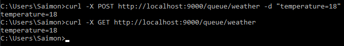
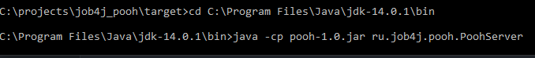
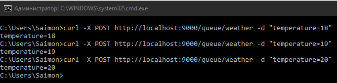
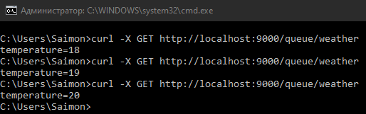

# Pooh JMS
[](https://travis-ci.com/saimon494/job4j_pooh)

## О проекте

В данном проекте написан аналог асинхронной очереди. Приложение запускает Socket и ждет клиентов. 
В качестве клиента использован [cURL](https://curl.se/download.html). В качестве протокола - HTTP.
Сервер представляет собой систему обмена сообщениями на базе потокобезопасных классов из пакета `java.util.concurrent`.

Клиенты могут как отправлять так и принимать сообщения. Система может работать в двух режимах:

- Queue - все клиенты записывают (отправляют сообщения) и читают (получают сообщения) из одной и той же очереди. 
В примере ниже weather произвольное название очереди и temperature=18 значение параметра.  





- Topic - у каждого клиента своя собственная очередь. Другими словами, каждый клиент читает из своей собственной очереди, но также может записывать (отправлять сообщения) в очереди всех остальных клиентов.

## Сборка

Для сборки проекта необходимо:
1. Установить JDK 14.
2. Скачать из [папки](https://github.com/saimon494/job4j_pooh/tree/master/target) файл `pooh-1.0.jar` и скопировать его в `C:\Program Files\Java\jdk-14.0.1\bin`.

## Использование
Запускаем сервер из `cmd`:
```
java -cp pooh-1.0.jar ru.job4j.pooh.PoohServer
```


Отправляем в очередь weather 3 сообщения из одного клиента и считываем их с другого:




## Контакты
[](https://t.me/Saimon494)